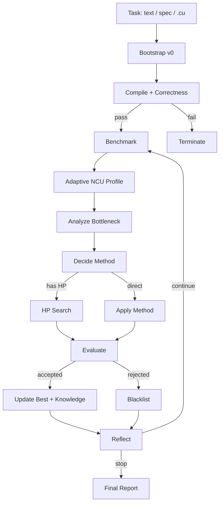

# CUDA Opt Agent

LLM 驱动的 CUDA 算子优化 Agent。给它一个自然语言任务、结构化 spec，或已有 `.cu` 文件，它会自动生成 baseline、编译校验、真实 GPU benchmark、执行 Nsight Compute profiling、分析瓶颈、生成新版本，并把有效经验沉淀到知识库中。

## Highlights

- 支持自然语言、YAML/TOML/JSON spec、已有 `.cu` 三种输入方式。
- 每个版本都经过 `nvcc` 编译、正确性校验和真实 GPU benchmark。
- 自适应多阶段 NCU Profiling：先分类瓶颈，再按 memory / compute / latency 路径深挖。
- LLM 自主选择优化方法；有超参时自动生成候选并可并行编译。
- 只接受真实提速版本；失败方法和超参写入黑名单，避免重复踩坑。
- 运行过程完整落盘：代码、状态、profile、reasoning、final report。
- 支持断点续跑和跨运行知识库。

## Architecture


## How It Works



## Requirements

| 依赖 | 说明 |
|------|------|
| Python | `>=3.10` |
| CUDA Toolkit | 需要 `nvcc` |
| Nsight Compute | 需要 `ncu` |
| NVIDIA Driver | 需要可访问 GPU |
| LLM API | Anthropic 或 OpenAI-compatible 接口 |

## Install

```bash
pip install -e ".[dev]"
cuda-opt --help
```

## Configure

在项目根目录创建 `.env`。至少配置一个 LLM provider。

```dotenv
# LLM provider: anthropic or openai
LLM_PROVIDER=openai

# OpenAI / OpenAI-compatible gateway
OPENAI_API_KEY=your_key_here
OPENAI_MODEL=gpt-4o
# OPENAI_BASE_URL=https://your-gateway.example.com/v1

# Anthropic
ANTHROPIC_API_KEY=your_key_here
ANTHROPIC_MODEL=claude-sonnet-4-20250514

# Optimization budget
DEFAULT_DTYPE=fp16
MAX_ITERATIONS=30
CONSECUTIVE_REJECT_LIMIT=5
ACCEPT_EPSILON=0.005
COMPILE_REPAIR_MAX_RETRIES=3
DECIDE_RESELECT_MAX_RETRIES=3
HP_CANDIDATE_COUNT=5
HP_COMPILE_WORKERS=0

# Benchmark / profiling
BENCHMARK_WARMUP_ROUNDS=10
BENCHMARK_MEASURE_ROUNDS=100
NCU_LAUNCH_COUNT=3
NCU_WARMUP_ROUNDS=1
NCU_PROFILE_ROUNDS=1
MULTI_SHAPE_AGGREGATOR=mean

# Outputs
RUNS_DIR=runs
KNOWLEDGE_BASE_DIR=knowledge_base
CONSOLE_ENCODING=auto
```

配置优先级：`CLI 显式参数 > 环境变量 > .env > 代码默认值`。

## Quick Start

### Natural Language

```bash
cuda-opt new batchnorm --task "写一个 fp16 batchnorm"
```

### Structured Spec

```bash
cuda-opt new softmax --spec tasks/softmax_fp16.yaml
```

### Existing CUDA File

```bash
cuda-opt tune kernels/fused_attention.cu --operator fused_attention --task "保持 mask 语义不变"
```

### Multi-shape Sweep

```bash
cuda-opt run gemm --shapes "1024^3;2048^3;4096^3" --multi-shape-aggregator worst
```

### Resume

```bash
cuda-opt resume runs/batchnorm_run_20260506T030613
```

### Inspect

```bash
cuda-opt list
cuda-opt show runs/batchnorm_run_20260506T030613
cuda-opt diff runs/batchnorm_run_20260506T030613 v0 v3
```

## Task Spec Example

```yaml
name: softmax
signature: "y[B,N] = softmax(x[B,N], dim=-1)"
dtypes: {x: fp16, y: fp16}
task_description: |
  实现数值稳定的 fp16 softmax，沿最后一维归一化。
constraints:
  - "避免只用单 block 处理超长行"
shape_profiles:
  - {x: [1024, 1024], y: [1024, 1024]}
  - {x: [4096, 4096], y: [4096, 4096]}
```

已有 CUDA 文件作为 seed：

```yaml
name: fused_attention
signature: "out = fused_attention(q, k, v, mask)"
dtypes: {q: fp16, k: fp16, v: fp16, mask: bool, out: fp16}
seed_code_path: ../kernels/fused_attention.cu
task_description: "保持 mask 和 causal 语义不变"
```

## CLI Cheatsheet

| 命令 | 用途 |
|------|------|
| `cuda-opt new <op>` | 新建任务，支持 `--task`、`--spec`、`--from-cu` |
| `cuda-opt tune <file.cu>` | 从已有 CUDA 文件继续优化 |
| `cuda-opt run <op>` | 兼容旧入口，适合快速 shape / dtype 试验 |
| `cuda-opt resume <run>` | 续跑未完成任务 |
| `cuda-opt list` | 列出 runs |
| `cuda-opt show <run>` | 查看 run 汇总 |
| `cuda-opt diff <run> v0 v3` | 对比两个版本代码 |

## Agent Features

### Bootstrap

Agent 会从任务描述生成可编译、可校验、可 benchmark 的 `v0`。如果传入已有 `.cu`，它会把该文件作为 seed，并只做必要封装和 harness 补齐。

### Compile And Validate

所有版本必须先通过 `nvcc` 编译和 correctness check。编译或校验失败时，会触发低 temperature 的 LLM repair。

### Benchmark

使用 kernel 自带 harness 输出 JSON，统计 median / p95 latency。多 shape 模式会逐 shape 测量，再按 `mean`、`worst` 或 `weighted` 聚合。

### Adaptive NCU Profiling

NCU profile 分阶段执行：

- Phase 1：固定采集分类指标，判断 memory-bound、compute-bound 或 latency-bound。
- Phase 2：只采集对应路径的深挖指标，减少无关 metric replay。
- Phase 3：当资源接近饱和时补抓互补指标，提示 Agent 切换优化方向。

输出给 LLM 的不是裸指标列表，而是结构化诊断报告：分类、主瓶颈、饱和度、可行动指标和建议方向。

### Analyze And Decide

`analyze` 节点读取 benchmark、NCU 诊断、历史迭代和知识库，归纳瓶颈。`decide` 节点选择下一步优化方法；如果选中黑名单方法，会自动要求重选。

### HP Search

当方法带超参时，Agent 让 LLM 生成多组候选。候选代码串行生成、可并行编译；正确性和 benchmark 串行执行，避免同一 GPU 上并发测量互相干扰。

### Evaluate And Reflect

只有 trial latency 相对 best 达到 `ACCEPT_EPSILON` 才会被接受。失败版本写入黑名单，成功版本可写入知识库。每轮 reflection 会落盘到 `reasoning_log.md`。

### Resume And Memory

每个 run 都保存完整 `state.json`。中断后可以按 run 目录或算子名续跑。知识库按算子和硬件签名组织，以软提示方式注入后续优化。

## Outputs

默认输出在 `runs/<operator>_run_<timestamp>/`。

| 文件 | 说明 |
|------|------|
| `state.json` | 当前完整状态 |
| `history.jsonl` | 迭代历史 |
| `config.json` | 本次配置快照 |
| `reasoning_log.md` | 每轮反思与归因 |
| `iter*/code.cu` | 生成的 CUDA 代码 |
| `iter*/compile.log` | 编译日志 |
| `iter*/ncu_report.txt` | 结构化 NCU 诊断 |
| `iter*/ncu_report.phase*.txt` | 每阶段 NCU 原始报告 |
| `best.txt` | 当前 best 版本目录 |
| `final_report.md` | 最终总结 |

## Project Structure

```text
src/cuda_opt_agent/
├── cli.py                 # Typer CLI
├── config.py              # .env config loader
├── task_spec.py           # YAML/TOML/JSON task specs
├── shape_profiles.py      # shape profile parsing
├── agent/
│   ├── graph.py           # LangGraph workflow
│   ├── state.py           # GraphState
│   ├── llm_client.py      # LLM wrapper
│   ├── temperatures.py    # per-node temperature policy
│   ├── prompts/           # prompt templates
│   └── nodes/             # init/bootstrap/profile/analyze/decide/... nodes
├── tools/
│   ├── compile.py         # nvcc compile
│   ├── correctness.py     # correctness check
│   ├── benchmark.py       # benchmark runner
│   ├── profile.py         # adaptive NCU profiling
│   └── hardware.py        # GPU info
├── memory/
│   ├── persistence.py     # run artifacts
│   ├── run_state.py       # RunState manager
│   └── knowledge.py       # cross-run knowledge base
├── models/                # Pydantic data models
├── codegen/               # code extraction / verification helpers
└── tui/                   # Rich/Textual UI
```

## Test

```bash
pytest -q -m "not api"
pytest -q -m api
```

## Notes

- Generated kernels must support `--check`, `--warmup`, `--rounds`, and optional `--shape key=value` arguments.
- Files are written as UTF-8. On Windows, terminal encoding can be controlled with `CONSOLE_ENCODING`.
- `best.txt` is the cross-platform best pointer; directory symlink is optional via `ENABLE_BEST_SYMLINK=1`.

## License

MIT
