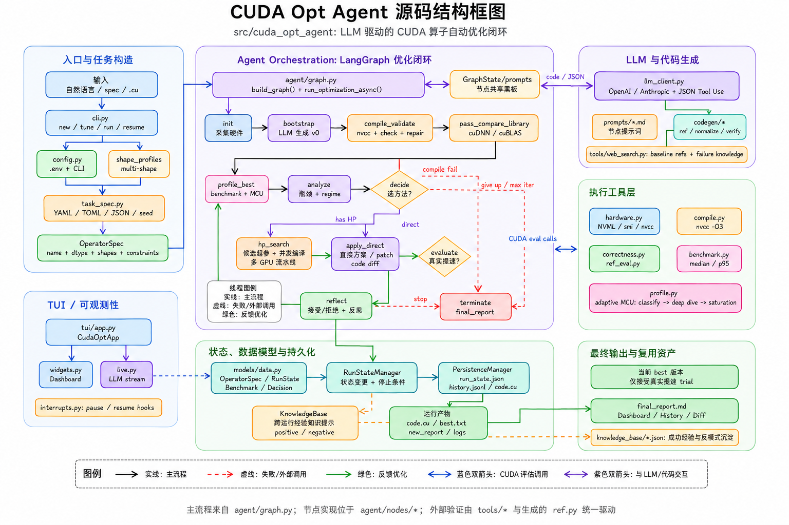
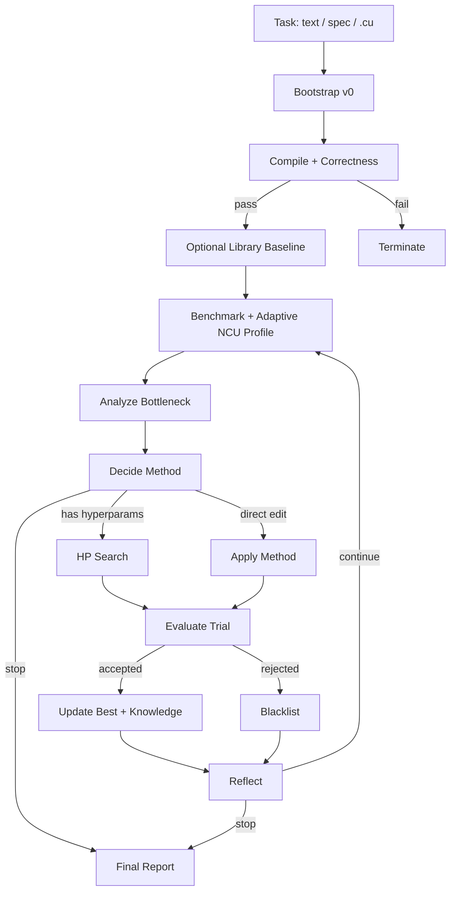

# CUDA Opt Agent

LLM 驱动的 CUDA 算子优化 Agent。给它自然语言任务、结构化 spec，或已有 `.cu` 文件，它会自动生成/修复 CUDA 代码，编译校验，真实 GPU benchmark，执行 Nsight Compute profiling，并在多轮迭代中保留真正变快的版本。

项目目标很直接：把 CUDA kernel 优化流程从“人工试错 + 看 profile + 改代码”变成可追踪、可续跑、可复用经验的自动化闭环。

## Highlights

- 支持三种输入：自然语言、YAML/TOML/JSON spec、已有 `.cu` seed。
- 每个候选版本都会经过 `nvcc` 编译、正确性校验和真实 GPU benchmark。
- 使用自适应 NCU profiling：先判断 memory / compute / latency 瓶颈，再采集相关深挖指标。
- LLM 负责分析瓶颈、选择优化方法、生成代码和超参候选。
- 只接受相对当前 best 真实提速的 trial；失败方法会进入黑名单。
- 支持多 shape benchmark，按 `mean`、`worst` 或 `weighted` 聚合延迟。
- 支持多 GPU 分发 HP 候选、跨 shape 并行 correctness check。
- 每次 run 全量落盘，支持中断后续跑和跨运行知识库。

## Architecture



核心流程由 LangGraph 编排，运行状态由 `RunStateManager` 持久化，代码生成和评估结果都写入 `runs/`。



## Requirements

| 依赖 | 说明 |
|------|------|
| Python | `>=3.10` |
| CUDA Toolkit | 需要 `nvcc` |
| NVIDIA GPU / Driver | 需要可访问 CUDA GPU |
| Nsight Compute | 需要 `ncu`，用于 profiling |
| LLM API | Anthropic 或 OpenAI-compatible provider |

可选依赖：如果启用 bootstrap 外部搜索，可配置 Exa、Tavily 或 SerpAPI。

## Install

```bash
pip install -e ".[dev]"
cuda-opt --help
```

如果只运行主程序，不需要测试依赖：

```bash
pip install -e .
```

## Configure

在项目根目录创建 `.env`。至少配置一个 LLM provider。

OpenAI 或 OpenAI-compatible 网关：

```dotenv
LLM_PROVIDER=openai
OPENAI_API_KEY=your_key_here
OPENAI_MODEL=gpt-5.5
# OPENAI_BASE_URL=https://your-gateway.example.com
```

Anthropic：

```dotenv
LLM_PROVIDER=anthropic
ANTHROPIC_API_KEY=your_key_here
ANTHROPIC_MODEL=claude-sonnet-4-20250514
# ANTHROPIC_BASE_URL=https://your-gateway.example.com
```


完整模板见 `.env.example`。配置优先级：CLI 显式参数 > 环境变量 > `.env` > 代码默认值。

## Quick Start

### Natural Language

```bash
cuda-opt new layernorm --task "写一个 fp16 layernorm" --shapes "1024^2;2048^2;4096^2"
```

### Structured Spec

```bash
cuda-opt new softmax --spec examples/softmax.yaml
```

### Existing CUDA File

```bash
cuda-opt tune kernels/fused_attention.cu --operator fused_attention --task "保持 mask 语义不变"
```

### Compatibility Entry

```bash
cuda-opt run gemm --shapes "1024^3;2048^3;4096^3" --multi-shape-aggregator worst
```

### Resume

```bash
cuda-opt resume runs/layernorm_run_20260507T120000
cuda-opt resume layernorm --extra-iters 3
```

### Inspect

```bash
cuda-opt list
cuda-opt show runs/softmax_run_20260510T122612
cuda-opt diff runs/softmax_run_20260510T122612 v0 v3
```

## CLI Overview

| 命令 | 用途 |
|------|------|
| `cuda-opt new <op>` | 新建任务，支持 `--task`、`--spec`、`--from-cu` |
| `cuda-opt tune <file.cu>` | 从已有 CUDA 文件作为 v0 seed 继续优化 |
| `cuda-opt run <op>` | 兼容旧入口，适合快速 shape / dtype 试验 |
| `cuda-opt resume <target>` | 从 run 目录、run id 或算子名续跑 |
| `cuda-opt list` | 列出 runs |
| `cuda-opt show <run>` | 查看 run 汇总和最终报告 |
| `cuda-opt diff <run> <left> <right>` | 对比两个版本的 CUDA 代码 |

常用参数不需要都写进 `.env`，CLI 上临时覆盖即可：

```bash
cuda-opt new softmax \
  --spec examples/softmax.yaml \
  --max-iters 8 \
  --hp-candidate-count 4 \
  --multi-shape-aggregator weighted
```

## Task Spec

Spec 支持 YAML、TOML、JSON。最小结构如下：

```yaml
name: softmax
signature: "Y = softmax(X, dim=-1)"
task_description: "Row-wise numerically stable softmax"
dtypes:
  default: fp16
shapes:
  B: 2048
  N: 2048
constraints:
  - "use max-subtraction for numerical stability"
shape_profiles:
  - B: 1024
    N: 512
    _weight: 0.3
  - B: 2048
    N: 2048
    _weight: 0.5
  - B: 4096
    N: 8192
    _weight: 0.2
```

已有 CUDA 文件也可以写入 spec：

```yaml
name: fused_attention
signature: "out = fused_attention(q, k, v, mask)"
dtypes:
  q: fp16
  k: fp16
  v: fp16
  mask: bool
  out: fp16
seed_code_path: ../kernels/fused_attention.cu
task_description: "保持 mask 和 causal 语义不变，只优化性能"
```

`shape_profiles` 用于多 shape sweep。`_weight` 只在 `weighted` 聚合时使用。

## Shape Syntax

CLI 的 `--shapes` 支持两种写法：

```bash
# 按算子默认维度名解析，例如 gemm => M,N,K
cuda-opt new gemm --task "optimize fp16 gemm" --shapes "1024^3;2048^3"

# 显式维度名，更推荐
cuda-opt new softmax --task "row softmax" --shapes "B=1024,N=1024;B=4096,N=8192"
```

内置 profile 名：`small`、`medium`、`large`、`sweep`。当前内置支持 `gemm`、`softmax`、`layernorm`。

```bash
cuda-opt new layernorm --task "optimize layernorm" --shape-profile sweep
```

## How It Works

### Bootstrap

Agent 先生成可编译、可校验、可 benchmark 的 `v0`。如果输入已有 `.cu`，它会作为 seed code，并补齐必要的 harness 和任务上下文。

### Compile And Validate

所有版本必须先通过 `nvcc` 编译和 correctness check。编译失败时会触发 compile repair；HP 候选 correctness 失败时也可做有限次数修复。

### Benchmark

benchmark 使用 CUDA event 统计 latency，优先解析 JSON 输出，也兼容简单 key-value 输出。多 shape 模式会逐 shape 测量，再聚合为一个决策延迟。

### Adaptive NCU Profiling

NCU 分阶段采集指标：

- Phase 1：固定采集分类指标，判断 memory-bound、compute-bound 或 latency-bound。
- Phase 2：只采集对应路径的深挖指标，减少无关 metric replay。
- Phase 3：当资源接近饱和时补抓互补指标，提示 Agent 切换优化方向。

给 LLM 的不是裸指标列表，而是结构化诊断：瓶颈类型、饱和度、关键 stall、可行动指标和建议方向。

### Analyze And Decide

`analyze` 读取 benchmark、NCU 诊断、历史迭代和知识库，归纳性能瓶颈。`decide` 选择下一步优化方法；如果命中黑名单，会要求重选或停止。

### HP Search

当方法带超参时，LLM 生成多组候选。候选代码可并发生成和编译；通过编译与正确性校验后再 benchmark。多 GPU 环境可通过 `GPU_IDS` 分发候选，避免所有 trial 抢同一张卡。

### Evaluate And Reflect

trial 只有相对当前 best 达到 `ACCEPT_EPSILON` 才会被接受。成功经验和失败教训会写入知识库或黑名单；每轮 reflection 会追加到 `reasoning_log.md`。

### Resume And Memory

每个 run 都有 `state.json` 作为权威状态。中断后可按目录、run id 或算子名续跑。知识库按算子和硬件签名组织，后续任务会以软提示方式复用经验。

## Outputs

默认输出在 `runs/<operator>_run_<timestamp>/`。

| 路径 | 说明 |
|------|------|
| `state.json` | 当前完整状态，续跑的权威源 |
| `history.jsonl` | 迭代历史追加日志 |
| `config.json` | 本次运行配置快照 |
| `reasoning_log.md` | 每轮反思与归因 |
| `ref.py` | PyTorch 参考实现和 CUDA runner |
| `benchmark_runner.py` | benchmark 入口 |
| `iterv*/code.cu` | 每个版本生成的 CUDA 代码 |
| `iterv*/compile.log` | 编译日志 |
| `iterv*/benchmark.json` | benchmark 结果 |
| `iterv*/ncu_report.txt` | 结构化 NCU 诊断 |
| `iterv*/ncu_report.phase*.txt` | 分阶段 NCU 原始报告 |
| `best.txt` | 当前 best 版本指针 |
| `final_report.md` | 最终总结 |

`best.txt` 是跨平台 best 指针。目录 symlink 是可选行为，需要时设置 `ENABLE_BEST_SYMLINK=1`。

## Project Structure

```text
src/cuda_opt_agent/
├── cli.py                 # Typer CLI: new / tune / run / resume / list / show / diff
├── config.py              # .env loader and AgentConfig construction
├── task_spec.py           # YAML/TOML/JSON OperatorSpec loading
├── shape_profiles.py      # shape profile parsing and CLI shape args
├── interrupts.py          # interruption helpers
├── agent/
│   ├── graph.py           # LangGraph workflow
│   ├── state.py           # GraphState TypedDict
│   ├── llm_client.py      # Anthropic / OpenAI-compatible wrapper
│   ├── temperatures.py    # per-node temperature policy
│   ├── prompts/           # analyze / decide / apply / repair prompt templates
│   └── nodes/             # workflow node implementations
├── codegen/
│   ├── ref_generator.py   # generated ref.py and benchmark runner
│   ├── normalizer.py      # code extraction / normalization
│   └── verifier.py        # quick CUDA code structure checks and diffs
├── memory/
│   ├── persistence.py     # run artifacts, state and history persistence
│   ├── run_state.py       # RunStateManager
│   └── knowledge.py       # cross-run knowledge base
├── models/
│   ├── data.py            # Pydantic models
│   └── enums.py           # enums and method normalization
├── tools/
│   ├── compile.py         # nvcc compile helpers
│   ├── correctness.py     # correctness checks
│   ├── benchmark.py       # benchmark execution and aggregation
│   ├── profile.py         # adaptive Nsight Compute profiling
│   ├── hardware.py        # GPU / CUDA hardware discovery
│   ├── ref_eval.py        # reference evaluation helpers
│   └── web_search.py      # optional external search providers
└── tui/
    ├── app.py             # Rich/Textual UI shell
    ├── live.py            # streaming output helpers
    └── widgets.py         # UI widgets
```

其他目录：

| 路径 | 说明 |
|------|------|
| `examples/` | 示例 task specs |
| `tests/` | 单元测试和集成测试 |
| `asset/` | README 图和架构资源 |
| `runs/` | 本地运行产物，通常不应提交 |
| `knowledge_base/` | 本地优化经验库 |

## Generated Kernel Contract

Agent 生成或接管的 CUDA runner 需要支持这些基本行为：

- `--check`：执行 correctness check。
- `--warmup <n>` 和 `--rounds <n>`：执行 benchmark。
- `--shape key=value ...`：接收 shape profile 参数。
- 输出 JSON 或 key-value latency 结果，便于 `benchmark.py` 解析。

如果输入是已有 `.cu`，建议保持 kernel 入口、shape 语义和数值约束清晰；其余 harness 可以让 Agent 补齐或修复。


## Notes

- `.env` 可能包含 API key，不要提交。
- `runs/` 会包含生成代码、编译产物、profile 报告和 reasoning 记录。
- `knowledge_base/` 是本地经验库，可按团队需求决定是否共享。
- 对 tiny kernel，真实提升可能接近 kernel launch floor，建议增加 shape 或 rounds 复核。
- 对多 GPU 机器，`GPU_IDS=0,1,2,3` 可让 HP 候选分散执行，但单卡 benchmark 仍会串行化以减少竞争。

## License

MIT
